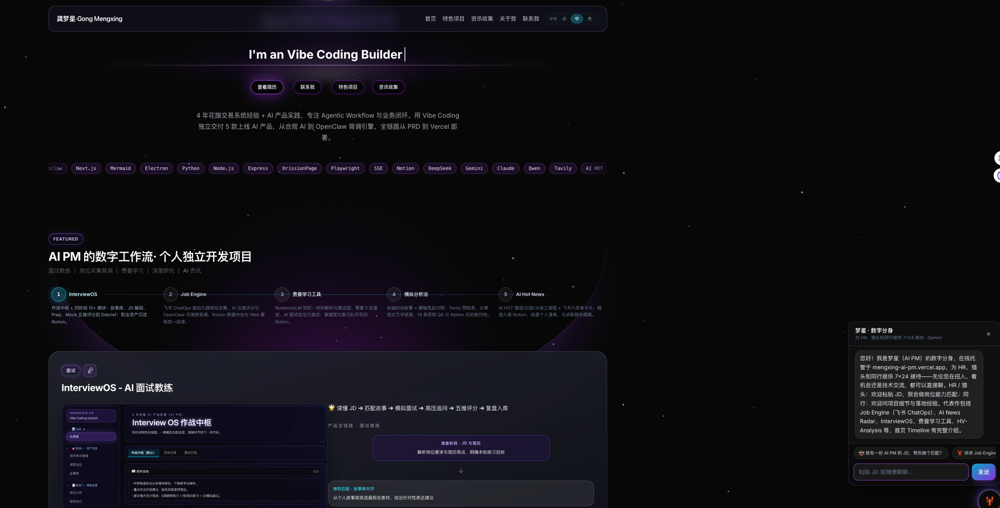
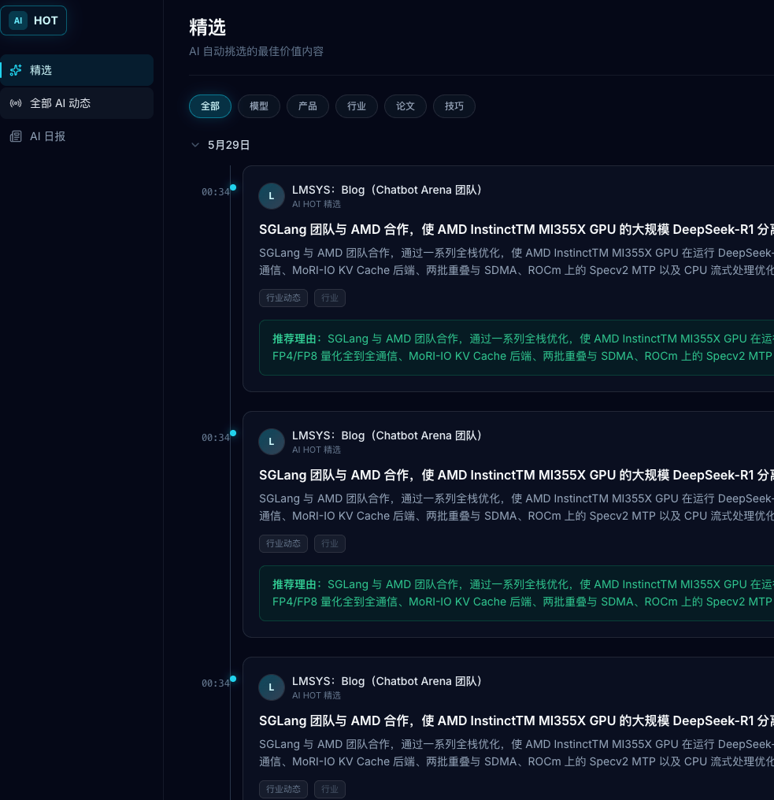
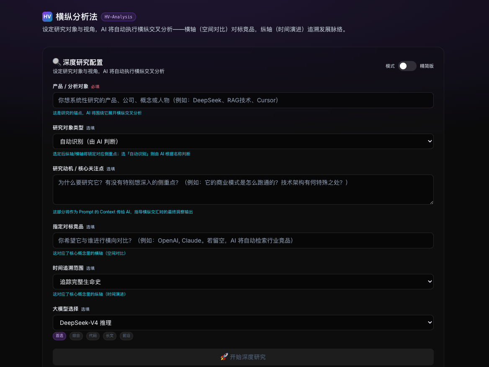

# my-ai-portfolio


### 首页结构

自上而下：**Hero** → **数字工作流**（`TimelineBento`）→ **AI 资讯雷达**（`#insights`）→ **关于我**（`#about`）。导航锚点「资讯收集」指向 `#insights`；「联系我」指向 `#about`。Hero 区「查看简历」与联系区简历图标均指向 `/resume`。




## 简历 (Resume)

在线简历与 PDF 下载已集成至站点，内容根据首页 **特色项目**（`lib/featured-projects.ts`）同步维护。

| 入口 | 路径 | 说明 |
|------|------|------|
| 在线查看 | `/resume` | 网页版简历，支持打印样式 |
| 下载 PDF | `/resume/resume.pdf` | 静态 PDF，文件名 `龚梦星_AI产品经理_简历.pdf` |
| Hero 按钮 | 首页「查看简历」 | 跳转 `/resume` |
| 联系区 | `#contact` 简历图标 | `CONTACT_LINKS.resume` → `/resume` |

### 文件结构

```
lib/resume-data.ts              # 简历数据源（网页与 PDF 共用）
resume/resume.md                # Markdown 源稿（便于人工编辑对照）
resume/resume-print.html        # PDF 用 HTML（npm run generate-resume-pdf 自动生成）
app/resume/page.tsx             # 在线简历页
public/resume/resume.pdf        # 可下载 PDF
scripts/generate-resume-pdf.ts  # Puppeteer 生成脚本
```

### 更新简历

1. 修改 `lib/resume-data.ts`（单一事实来源；亦可同步编辑 `resume/resume.md` 作对照）
2. 重新生成 PDF：

```bash
npm run generate-resume-pdf
```

首次运行需已安装 dev 依赖 `puppeteer`（`npm install` 会一并安装）。脚本会写入 `resume/resume-print.html` 与 `public/resume/resume.pdf`。

简历独立 AI 产品部分覆盖 5 款特色项目：**InterviewOS**、**Job Engine**、**费曼学习工具**、**横纵分析法**、**AI News Radar**；花旗工作经历保持原有 ATS 表述。

---


| 时段 | 项目 | 路径 | 说明 |
|------|------|------|------|
| 05:00 | 全自动求职与背调引擎 | 外部站点 | 飞书 ChatOps 中枢 + OpenClaw 溯源背调 + 9 平台爬虫 → Notion（Job Engine） |
| 09:00 | AI News Radar | `/ai-news` | Engine A 入库 Notion + AI HOT 日报；与 Job Engine **共用** `feishu_gateway`；飞书 6 菜单 → Node 卡片 |
| 14:00 | 费曼学习工具 | `/learning` | 双模态学习 + AI 面试官，掌握度写回 Notion |
| 15:00 | InterviewOS | 外部站点 | 全链路 AI 面试教练，JD 解码与五维评分 |
| 18:30 | **横纵分析法 (HV-Analysis)** | `/tools/hv-analysis` | 深度研究引擎，分章流式报告 + QA 审计 + Notion 归档 |

---

## 数字工作流 · OpenClaw × 飞书 ChatOps

> **飞书是操作台，OpenClaw 是背调引擎，Notion 是数据中台。** 日常不再依赖 Cron 并发；所有指令从飞书进入，由 `interview/job_engine/feishu_gateway.py` 长连接门卫统一路由。

### 为什么需要 OpenClaw + 飞书联动

| 角色 | 职责 |
|------|------|
| **飞书** | 手机端唯一入口：菜单引导、单平台/全量抓取、今日简报、深度背调、AI 资讯卡片 |
| **feishu_gateway.py** | WebSocket 门卫：消息去重 → AI 资讯最高优先级转发 Node → `route_intent` 分流爬虫/简报/背调 |
| **OpenClaw** | **仅**在自然语言背调场景唤醒：`job-insight` 技能强制联网检索（web_search / web_fetch），输出须附真实 URL，避免「幻觉背调」 |
| **openclaw_bridge.py** | 爬虫 JSON → DeepSeek 五维岗位评分 → Notion 同步（与 OpenClaw CLI 背调路径解耦，共用 `openclaw_jobs.json` 数据文件命名） |
| **Notion** | Headless CMS：岗位库 + 背调报告 Block 锚点写入 |
| **Next.js 看板** | 从 Notion 递归渲染岗位 JD 与背调长文 |

### 全链路工作流（三条路径）

```
                    ┌─────────────────────────────────────┐
                    │  飞书用户 · 菜单 / 自然语言指令      │
                    └──────────────────┬──────────────────┘
                                       ▼
                    ┌─────────────────────────────────────┐
                    │  feishu_gateway.py (WebSocket)       │
                    │  ① 去重  ② AI资讯6菜单→Node (优先)   │
                    │  ③ route_intent 其余指令              │
                    └──────────┬────────────┬─────────────┘
                               │            │
         ┌─────────────────────┼────────────┼─────────────────────┐
         ▼                     ▼            ▼                     ▼
   【路径 A 采集】        【路径 B 背调】   【路径 C 简报】    【路径 D 资讯】
   抓取BOSS/全面抓取      帮我背调XX      今日简报           看今日日报等
         │                     │            │                     │
         ▼                     ▼            ▼                     ▼
   9平台爬虫串行          OpenClaw         Notion 24h           Node :3001
   subprocess            job-insight      入库筛选              aihot-router
         │                web 溯源              │                     │
         ▼                     │            ▼                     ▼
   openclaw_jobs.json          │         DeepSeek 提炼          飞书 interactive
         │                     │            │                     卡片
         ▼                     ▼            └──────────┬──────────┘
   openclaw_bridge              │                       ▼
   DeepSeek 评分                │                  飞书会话回执
         │                     ▼
         ▼               DeepSeek 合成报告
   notion_sync                  │
         │                     ▼
         └──────────► Notion 岗位库 ◄── replace_report_blocks 写入背调
                              │
                              ▼
                    Next.js / Electron 岗位看板
```

#### 路径 A · 岗位采集（飞书驱动，非 OpenClaw CLI）

1. 用户在飞书发送「抓取字节跳动」或「全面抓取」  
2. 网关后台 **串行** 拉起 `spider_*.py` / `crawler_*.py`（全局互斥，防 OOM）  
3. 结果写入 `data/openclaw_jobs.json`，结束后可选执行 `openclaw_bridge.py`  
4. DeepSeek 对 JD 五维评分 → `notion_sync` 增量写入 Notion  
5. 每平台完成可推送结果卡片；全量结束后可再次桥接 Notion  

#### 路径 B · OpenClaw 深度背调（核心差异化）

1. 菜单「深度背调 / 背调指南」**只返回用法**，不启动 Agent  
2. 用户须发送带公司名的句式，如：`帮我背调一下 字节跳动`  
3. 后台线程：查 Notion 该公司岗位 JD → **OpenClaw** 多源 web 检索（失败则降级新闻源 + targets.json URL）  
4. DeepSeek 将「外部情报 + JD」合成 Markdown 背调报告  
5. 报告通过 Notion Block API **锚点替换**写入对应岗位页；飞书仅推 2 条核心情报 + Notion 链接  
6. 若触发降级自愈，额外推送巡检告警卡片  

#### 路径 C · 今日简报

1. 飞书「今日简报」→ 查 Notion **过去 24 小时入库**岗位（不限匹配分，过滤发现日）  
2. DeepSeek 提炼每条「核心匹配点」→ 组装极客风早报卡片回飞书  
3. 早报底部引导：可对感兴趣公司继续发「帮我背调一下 XX」走路径 B  

#### 路径 D · AI 资讯（本仓库 `my-ai-portfolio`）

与求职链路 **共用同一飞书门卫**，但命中 6 条资讯菜单暗号后立即 `POST http://127.0.0.1:3001/internal/news-card`，**不进入** `route_intent`，避免「看看」等词误触发背调。Web 精选入库走 Engine A（`ai-news-update`）；飞书菜单与日报 Tab 仍读 AI HOT API。详见下文 [AI News Radar](#ai-news-radar--每日-ai-资讯)。

### 本地启动双引擎

```bash
# 终端 1 — Node 卡片引擎（资讯菜单必需；背调路径不依赖）
cd ~/my-ai-portfolio && npm run feishu-local-api

# 终端 2 — Python 飞书门卫（求职 + 资讯统一入口）
cd ~/interview/job_engine && ./start_feishu.sh
```

完整命令、菜单暗号表与日志路径见 [job_engine/README.md](../interview/job_engine/README.md)。

---

## AI News Radar · 每日 AI 资讯

> **双引擎采集 + 三视图阅读 + 飞书触达。** 精选入库由 [ai-news-update](https://github.com/mengxingG/ai-news-update) Engine A（HN / Polymarket / YouTube）经 `fetch-news` 写入 Notion；AI 日报 Tab 仍直连 AI HOT 官方 API；飞书 6 菜单与 Job Engine **共用** `feishu_gateway.py` 门卫（资讯最高优先级，与背调/爬虫隔离）。

### 产品截图

文档用图位于仓库根目录 `images/`（站点内页面使用 `public/image/`）。

| Web 资讯雷达 `/ai-news` | 飞书卡片 · 日报 | 飞书卡片 · 精选 |
|:---:|:---:|:---:|
|  |  |  |

### 功能概览

- **三视图前端**（`/ai-news`）：**精选** / **全部 AI 动态**（Notion CMS，含 Engine A 入库）+ **AI 日报**（AI HOT 最近 30 期归档 + 按日正文，杂志排版）
- **首页预览**（`/#insights` · `AINewsWidget`）：展示 Notion 全量资讯，按时间倒序，最多 **20** 条；右侧仅保留「完整雷达」链至 `/ai-news` 与条数统计（**无**「今日热门 / 本周精选 / 月度回顾」筛选）
- **精选入库**：`npm run fetch-news` → `GET {AI_NEWS_UPDATE_API_URL}/api/news?topic=AI&days=1` → 北京时区今/昨过滤 → URL 去重写 Notion
- **飞书菜单卡片**：6 条底部子菜单暗号 → `feishu_gateway.py` 转发本地 Node → 拉 AI HOT 数据 → 飞书 interactive 卡片
- **标星**：Notion 字段同步，Web 端可收藏（`/api/ai-news/star`）

### 双引擎与数据流

| 引擎 | 仓库 / 平台 | 数据源 | 写入 Notion |
|------|-------------|--------|-------------|
| **Engine A** | `ai-news-update`（FastAPI） | HN / Polymarket / YouTube | `npm run fetch-news` |
| **Engine B** | Coze 工作流 | X / 中文媒体 / RSS | Make.com（可选） |

```
ai-news-update Engine A
  └─ GET /api/news?topic=AI&days=1
        └─ my-ai-portfolio: npm run fetch-news → Notion
              ├─ /ai-news 精选 · 全部
              └─ 首页 AINewsWidget（最多 20 条）

AI HOT 公开 API（日报 / 飞书分类菜单）
  └─ feishu-local-api :3001 ← feishu_gateway.py
        └─ aihot-router + feishu-card-builder → 飞书会话

/ai-news · AI 日报 Tab：/api/ai-news/dailies + /daily/{date}（不经 Notion）
```

### 飞书菜单暗号（须与飞书后台一字不差）

| 菜单文案 | 数据源 |
|----------|--------|
| 看今日日报 | AI HOT `GET /api/public/daily` |
| 看精选条目 | AI HOT `GET /api/public/items?mode=selected` |
| 看本周动态 | AI HOT `GET /api/public/items?mode=selected&since=7d` |
| 模型发布 | AI HOT `category=ai-models` |
| 产品发布 | AI HOT `category=ai-products` |
| 行业动态 | AI HOT `category=industry` |

> Web「精选 / 全部」读 Notion（Engine A + Engine B 入库）；飞书菜单与「AI 日报」Tab 仍读 AI HOT API。

### 环境变量

在 `.env.local` 中配置：

```bash
NOTION_API_KEY=
NOTION_AI_NEWS_DB_ID=    # AI 资讯雷达数据库

# Engine A 采集（ai-news-update FastAPI）
AI_NEWS_UPDATE_API_URL=http://127.0.0.1:8000
AI_NEWS_UPDATE_TOPIC=AI
AI_NEWS_UPDATE_DAYS=1
AI_NEWS_UPDATE_TIMEOUT_MS=180000

# 飞书（Webhook 路由 / 本地联调；生产推送由 job_engine 门卫承担）
FEISHU_APP_ID=
FEISHU_APP_SECRET=
```

### 本地开发

```bash
# 终端 1 — Engine A 采集服务（ai-news-update）
cd ~/news/ai-news-update && python server.py

# 终端 2 — 前端
cd ~/my-ai-portfolio && npm run dev
# 浏览器打开 http://localhost:3000/ai-news

# 终端 3 — 拉取 Engine A 写入 Notion（Engine A 就绪后执行）
npm run fetch-news

# 终端 4 — Node 卡片引擎（飞书联调；默认 127.0.0.1:3001）
npm run feishu-local-api
```

首页资讯数据在 `app/page.tsx` 服务端拉取 `fetchAINewsRadarFromNotion()`，传入 `HomePageClient` → `AINewsWidget`。

### 24 小时飞书双引擎（与 Job Engine 联动）

门卫与渲染引擎脚本在 **`../interview/job_engine/`**；作品集目录提供转发入口：

```bash
cd ~/interview/job_engine
./stop_feishu.sh && ./start_feishu.sh

# 或在 my-ai-portfolio 根目录
./stop_feishu.sh && ./start_feishu.sh
```

| 日志 | 路径 |
|------|------|
| Node 卡片引擎 | `~/my-ai-portfolio/node_api.log` |
| Python 飞书门卫 | `~/interview/job_engine/gateway.log` |

Python 使用 `conda run -n job_env python -u feishu_gateway.py`（`start_feishu.sh` 内已配置）。

### API 路由（本仓库）

| 路由 | 方法 | 说明 |
|------|------|------|
| `/api/ai-news/dailies` | GET | 日报归档（默认 `take=30`） |
| `/api/ai-news/daily/[date]` | GET | 指定日期日报正文 |
| `/api/ai-news/star` | PATCH | 标星开关 |
| `/api/ai-news-radar` | GET | Notion 资讯列表（JSON） |
| `/api/feishu` | POST | 飞书 Webhook 校验 / 事件（可选；主路径为 Python 长连接） |

### 关键目录

```
app/page.tsx                      # 首页 SSR：拉取 Notion 资讯列表
app/HomePageClient.tsx            # 首页布局（资讯雷达 #insights 在关于我 #about 之前）
app/components/AINewsWidget.tsx   # 首页资讯预览（无时间 Tab，最多 20 条）
app/ai-news/                      # 资讯雷达完整页（三视图）
app/components/ai-news/           # AiNewsGeekHub、DailyPanel、侧栏等
lib/cron-fetch-news.ts            # Engine A (ai-news-update) → Notion 入库
lib/aihot-daily-api.ts            # 日报 API 封装
utils/ai-news-time-range.ts       # 上海时区日期工具（飞书/分组等；首页 Widget 不再使用 Tab 过滤）
utils/ai-news-grouping.ts         # sortNewsNewestFirst 等列表工具
tools/aihot-router.ts             # 菜单暗号 → API + 卡片 payload
tools/feishu-card-builder.ts      # 飞书 interactive 卡片
feishu-local-api.ts               # 本地 HTTP 卡片引擎（POST /internal/news-card）
scripts/run-fetch-news.ts         # npm run fetch-news 入口
../news/ai-news-update/server.py  # Engine A FastAPI（HN / Polymarket / YouTube）
start_feishu.sh / stop_feishu.sh # 转发至 job_engine 双引擎脚本
../interview/job_engine/feishu_gateway.py   # 飞书 WebSocket 门卫（转发 Node）
../interview/job_engine/start_feishu.sh      # nohup 双引擎点火
```

### npm scripts（资讯相关）

| 命令 | 说明 |
|------|------|
| `npm run dev` | 本地站点（含首页资讯预览） |
| `npm run fetch-news` | Engine A → Notion 入库（依赖 ai-news-update 服务） |
| `npm run feishu-local-api` | 飞书卡片引擎（需与 Python 门卫联调） |
| `npm run generate-resume-pdf` | 从 `lib/resume-data.ts` 生成 `public/resume/resume.pdf` |

---

## 横纵分析法 (HV-Analysis)

> 方法论由数字生命卡兹克提出：纵轴沿时间追溯产品/公司/概念的完整生命史，横轴在当下截面与竞品系统性对比，在交汇处产出独到判断。



### 功能概览

- **深度研究配置**：研究对象、类型、动机、对标竞品、时间范围、大模型选择
- **联网检索**：Tavily 多源预采集，注入分章 Prompt
- **分章流式流水线**：定义 → 纵向（6k–15k 字）→ 横向（3k–10k 字）→ 横纵交汇，总篇幅可达 1–3 万字
- **14 条军规 QA 审计**：叙事体、竞品深度、套话禁区、万字体量等自动质检
- **Actor-Critic Auto-Refine**：未通过项一键触发 Claude 流式重写并 re-QA
- **导出**：Markdown 下载 / Puppeteer PDF（Node.js，兼容 Vercel）
- **Notion 研报库**：手动「存入 Notion」，左侧历史舱按时间倒序恢复正文与质检结果

### 研究闭环

```
定题（对象 · 类型 · 竞品）
  → 检索（Tavily 多源）
  → 纵轴（时间叙事）
  → 横轴（竞品对比）
  → 沉淀（QA · Notion）
```

### 环境变量

在 `.env.local` 中配置：

```bash
# 必需
DEEPSEEK_API_KEY=          # 主报告生成（DeepSeek 推理）
TAVILY_API_KEY=            # 联网搜索
NOTION_API_KEY=            # 或 NOTION_TOKEN
NOTION_DATABASE_ID_HV_ANALYSIS=  # hvSearch 研报数据库 ID

# 可选 — 质检 / Auto-Refine 经 gptsapi.net 中转（需 OPENAI_API_KEY）
OPENAI_API_KEY=
HV_QA_MODEL_ID=gemini-2.5-flash
HV_REFINE_MODEL_ID=claude-sonnet-4-6

# 可选 — Notion 列名映射（默认见下表）
NOTION_HV_PROP_TITLE=研究对象
NOTION_HV_PROP_TARGET=Target
NOTION_HV_PROP_TYPE=type
NOTION_HV_PROP_MOTIVATION=Motivation
NOTION_HV_PROP_COMPETITORS=Competitors
NOTION_HV_PROP_MODEL=Model
NOTION_HV_PROP_SCORE=Score          # Number 类型
NOTION_HV_PROP_QA_DATA=QA_Data
NOTION_HV_PROP_CREATED_AT=CreatedAt
```

| Notion 列 | 类型 | 来源 |
|-----------|------|------|
| 研究对象 | Title | `{targetName} · 横纵分析` |
| Target | Rich text | 研究对象名称 |
| type | Rich text | 研究对象类型 |
| Motivation | Rich text | 研究动机 / 核心关注点 |
| Competitors | Rich text | 指定对标竞品 |
| Model | Rich text | 大模型 ID |
| Score | Number | QA 总分 |
| QA_Data | Rich text | QA 结果 JSON |
| CreatedAt | Date | 存档日期 |

### PDF 导出依赖

PDF 导出使用 **Puppeteer + @sparticuz/chromium**（纯 Node.js，Vercel Serverless 可用）。`next.config.ts` 已配置 `outputFileTracingIncludes` 将 `chromium/bin` 打入部署包；`vercel.json` 为 PDF 路由分配 1024MB 内存（Pro 可改为 3008）。本地开发需安装 Google Chrome，或通过 `PUPPETEER_EXECUTABLE_PATH` 指定浏览器路径：

```bash
# 可选：自定义 Chrome 路径
PUPPETEER_EXECUTABLE_PATH=/Applications/Google\ Chrome.app/Contents/MacOS/Google\ Chrome
```

### API 路由

| 路由 | 方法 | 说明 |
|------|------|------|
| `/api/hv-analysis` | POST | 主流程：Tavily 检索 + 分章流式生成 + QA |
| `/api/hv-analysis/stream` | POST | 流式别名 |
| `/api/hv-refine` | POST | QA 驱动的 Actor-Critic 定向重写 |
| `/api/hv-qa` | POST | 独立 QA 评分 |
| `/api/hv-analysis/notion-save` | POST | 手动存入 Notion |
| `/api/hv-history` | GET | 历史研报列表 |
| `/api/hv-history/[id]` | GET | 单条研报详情（Markdown + QA） |
| `/api/hv-analysis/pdf` | POST | Markdown → PDF |

### 关键目录

```
app/tools/hv-analysis/page.tsx       # 前端主页面
components/hv-analysis/            # ConfigForm、QaInspector、HistoryReportSidebar 等
lib/hv-analysis/                   # notion-save、run-hv-qa、report-pdf-html、convert-markdown-to-pdf
app/api/hv-analysis/               # 主路由 + pdf/route.ts
src/prompts/hv-analysis.md         # 分章 Prompt 模板
lib/skills/hv-analysis/SKILL.md    # Cursor Agent Skill（方法论与写作规范）
```

---

## 文章详情：快 + 发布后立刻更新

文章详情对 Notion 的请求使用 **Next.js Data Cache**（`fetch` + `tags` + `revalidate: false`），日常访问会命中缓存，速度极快。

在 `.env.local` 增加随机密钥：

```bash
REVALIDATE_SECRET=你的长随机字符串
```

**发布 / 更新 Notion 文章后**，任选一种方式刷新缓存：

1. **只刷新某一篇**（`articleId` 为 Notion 页面 ID，带连字符的 UUID）：

```bash
curl -X POST "https://你的域名/api/revalidate" \
  -H "Content-Type: application/json" \
  -H "x-revalidate-secret: 你的长随机字符串" \
  -d '{"articleId":"xxxxxxxx-xxxx-xxxx-xxxx-xxxxxxxxxxxx"}'
```

2. **刷新所有已缓存的文章详情**（不记得具体 ID 时）：

```bash
curl -X POST "https://你的域名/api/revalidate" \
  -H "Content-Type: application/json" \
  -H "x-revalidate-secret: 你的长随机字符串" \
  -d '{"allArticles":true}'
```

可在 Notion 自动化、Zapier、或自建 Webhook 里对上述 URL 发 `POST`，实现「点发布 → 立刻调用 revalidate → 线上秒更新」。

## Deploy on Vercel

推荐部署至 [Vercel](https://vercel.com/new)。注意 Hobby 计划 serverless 超时约 10s，HV-Analysis 等长任务已通过 **TransformStream 流式** 规避；PDF 导出依赖 Node runtime 与本机 Python（本地开发）或对应 Serverless 配置。
